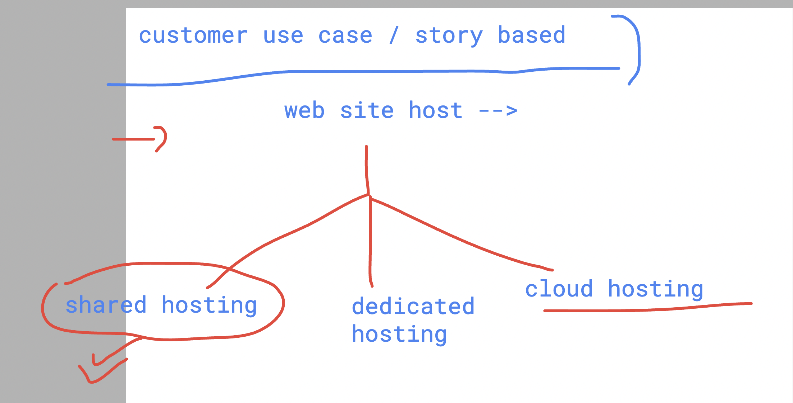
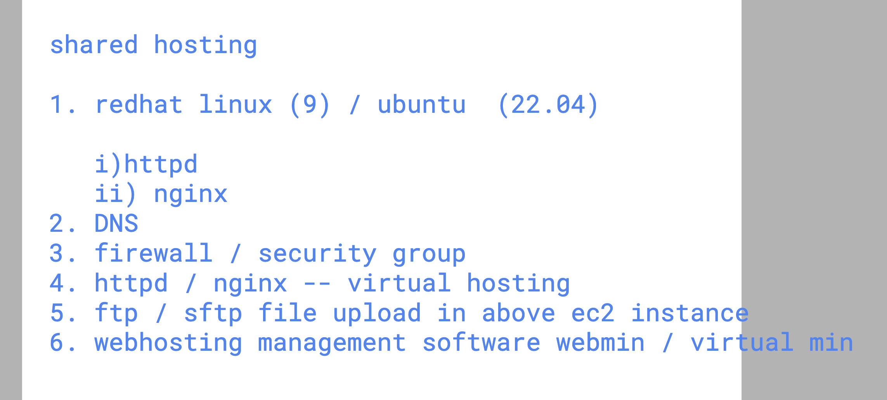
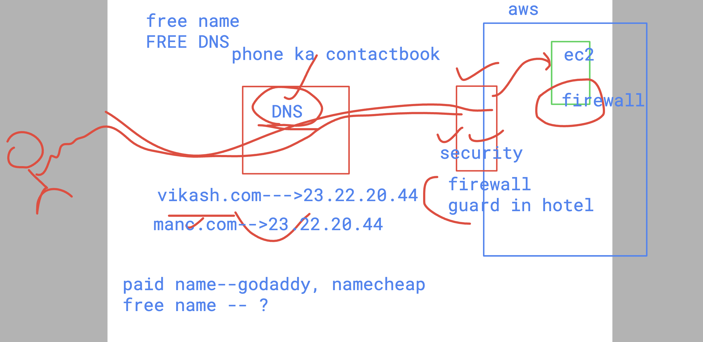
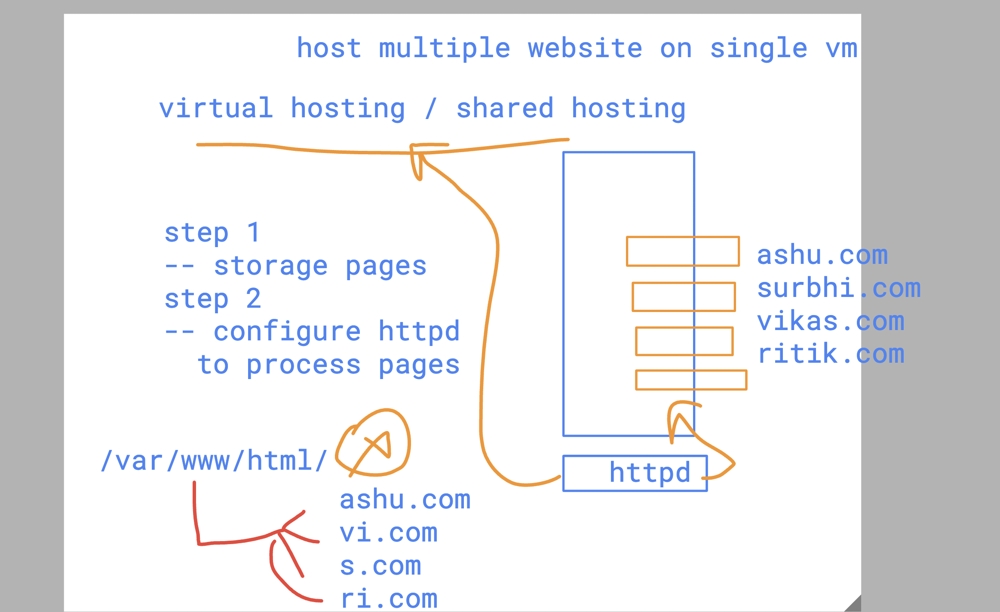

# SRE_Mastering

## Webhosting understanding pattern 



### things you need to know 



## httpd install and setup on rhel 9 

```
[ec2-user@ip-172-31-84-50 ~]$ id
uid=1000(ec2-user) gid=1000(ec2-user) groups=1000(ec2-user),4(adm),190(systemd-journal) context=unconfined_u:unconfined_r:unconfined_t:s0-s0:c0.c1023

[ec2-user@ip-172-31-84-50 ~]$ 
[ec2-user@ip-172-31-84-50 ~]$ rpm -q httpd
package httpd is not installed

[ec2-user@ip-172-31-84-50 ~]$ sudo dnf  install  httpd 
Updating Subscription Management repositories.
Unable to read consumer identity

This system is not registered with an entitlement server. You can use "rhc" or "subscription-manager" to register.

Red Hat Enterprise Linux 9 for x86_64 - AppStream from RHUI (RPMs)                                                             30 MB/s |  39 MB     00:01    
Red Hat Enterprise Linux 9 for x86_64 - BaseOS from RHUI (RPMs)                 
```

### verify installation 

```
rpm -q httpd
httpd-2.4.57-11.el9_4.1.x86_64

rpm -qi  httpd
Name        : httpd
Version     : 2.4.57
Release     : 11.el9_4.1
Architecture: x86_64
Install Date: Mon 02 Sep 2024 10:13:08 AM UTC
Group       : Unspecified
Size        : 60846
License     : ASL 2.0
Signature   : RSA/SHA256, Wed 07 Aug 2024 09:16:12 AM UTC, Key ID 199e2f91fd431d51
Source RPM  : httpd-2.4.57-11.el9_4.1.src.rpm
Build Date  : Tue 06 Aug 2024 01:08:48 PM UTC
Build Host  : x86-64-01.build.eng.rdu2.redhat.com
Packager    : Red Hat, Inc. <http://bugzilla.redhat.com/bugzilla>
Vendor      : Red Hat, Inc.
URL         : https://httpd.apache.org/
Summary     : Apache HTTP Server
Description :
The Apache HTTP Server is a powerful, efficient, and extensible
web server.

```

### note: create index.html the way you want to 

### httpd service start

```
sudo systemctl start httpd
[ec2-user@ip-172-31-84-50 html]$ sudo systemctl status httpd
● httpd.service - The Apache HTTP Server
     Loaded: loaded (/usr/lib/systemd/system/httpd.service; disabled; preset: disabled)
     Active: active (running) since Mon 2024-09-02 10:18:32 UTC; 4s ago
       Docs: man:httpd.service(8)
   Main PID: 14836 (httpd)
     Status: "Started, listening on: port 80"
      Tasks: 177 (limit: 4400)
     Memory: 22.0M
        CPU: 64ms
     CGroup: /system.slice/httpd.service
             ├─14836 /usr/sbin/httpd -DFOREGROUND
             ├─14837 /usr/sbin/httpd -DFOREGROUND
             ├─14838 /usr/sbin/httpd -DFOREGROUND
             ├─14839 /usr/sbin/httpd -DFOREGROUND
             └─14840 /usr/sbin/httpd -DFOREGROUND

Sep 02 10:18:32 ip-172-31-84-50.ec2.internal systemd[1]: Starting The Apache HTTP Server...
Sep 02 10:18:32 ip-172-31-84-50.ec2.internal systemd[1]: Started The Apache HTTP Server.
Sep 02 10:18:32 ip-172-31-84-50.ec2.internal httpd[14836]: Server configured, listening on: port 80
[ec2-user@ip-172-31-84-50 html]$ sudo systemctl enable httpd
Created symlink /etc/systemd/system/multi-user.target.wants/httpd.service → /usr/lib/systemd/system/httpd.service.
[ec2-user@ip-172-31-84-50 html]$ 


```

### understanding DNS 



### testing with local DNS 

```
humanfirmware@darwin  ~  sudo  vim /etc/hosts 
Password:
 humanfirmware@darwin  ~  cat  /etc/hosts
##
# Host Database
#
# localhost is used to configure the loopback interface
# when the system is booting.  Do not change this entry.
##
127.0.0.1	localhost
255.255.255.255	broadcasthost
::1             localhost

127.0.0.1  hello.xyz.com

23.22.20.44  vikash.com
 humanfirmware@darwin  ~  

```

## Understanding vhosting 



## Understanding internal of httpd 

```
cd  /etc/httpd/
[ec2-user@ip-172-31-84-50 httpd]$ ls
conf  conf.d  conf.modules.d  logs  modules  run  state
[ec2-user@ip-172-31-84-50 httpd]$ 


```

### main config file of httpd 

```
cd  /etc/httpd/
[ec2-user@ip-172-31-84-50 httpd]$ ls
conf  conf.d  conf.modules.d  logs  modules  run  state
[ec2-user@ip-172-31-84-50 httpd]$ cd conf
[ec2-user@ip-172-31-84-50 conf]$ ls
httpd.conf
```

### creating virtaulhost config 

```
[ec2-user@ip-172-31-84-50 httpd]$ ls
conf  conf.d  conf.modules.d  logs  modules  run  state
[ec2-user@ip-172-31-84-50 httpd]$ cd  conf.d/
[ec2-user@ip-172-31-84-50 conf.d]$ ls
autoindex.conf  README  userdir.conf  welcome.conf
[ec2-user@ip-172-31-84-50 conf.d]$ sudo vim  vikascom.conf
[ec2-user@ip-172-31-84-50 conf.d]$ sudo cp vikascom.conf  ashucom.conf 
[ec2-user@ip-172-31-84-50 conf.d]$ sudo cp vikascom.conf  surbhicom.conf
[ec2-user@ip-172-31-84-50 conf.d]$ sudo cp vikascom.conf  ritikcom.conf
[ec2-user@ip-172-31-84-50 conf.d]$ 

```
### sample vhost file 

```
[ec2-user@ip-172-31-84-50 conf.d]$ sudo vim vikascom.conf 
[ec2-user@ip-172-31-84-50 conf.d]$ cat  vikascom.conf 


<virtualhost *:80>
	servername  vikas.com
	documentroot  /var/www/vikas.com/


</virtualhost>
[ec2-user@ip-172-31-84-50 conf.d]$ 


```

### restart httpd 

```
[ec2-user@ip-172-31-84-50 conf.d]$ httpd -t
Syntax OK
[ec2-user@ip-172-31-84-50 conf.d]$ sudo systemctl restart  httpd
[ec2-user@ip-172-31-84-50 conf.d]$ 


```

## Note : in your laptop make below entry 

```

cat  /etc/hosts
##
# Host Database
#
# localhost is used to configure the loopback interface
# when the system is booting.  Do not change this entry.
##
127.0.0.1	localhost
255.255.255.255	broadcasthost
::1             localhost

127.0.0.1  hello.xyz.com

23.22.20.44  vikas.com
23.22.20.44  ashu.com

```

