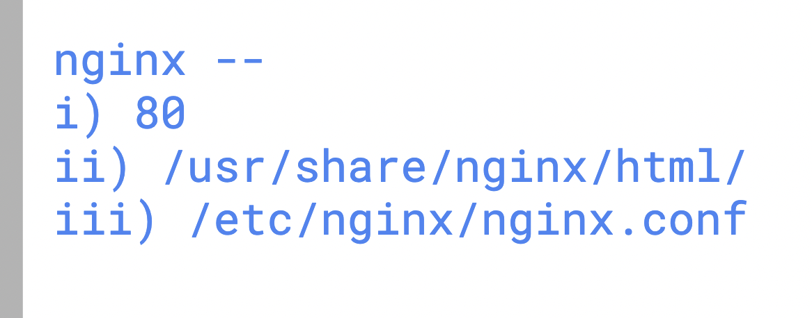

## Installing nginx(http) and vsftpd (ftp)

```
dnf install nginx vsftpd -y
```

### basic info about nginx 



### configuring vhost in nginx 

```
[root@ip-172-31-30-208 conf.d]# cat  /etc/nginx/conf.d/shtml.conf 
server {
        listen       80;
        listen       [::]:80;
        server_name  shtml.vikasweb.xyz;
        root         /usr/share/nginx/shtml;

    }


```

### for above step create 
```
mkdir /usr/share/nginx/shtml;
chown shtml:shtml  /usr/share/nginx/shtml
```

### starting service

```
systemctl enable --now nginx 
```

## For FTP upload 

```
dnf install vsftpd -y 
systemctl enable --now vsftpd
setenforce 0
```

