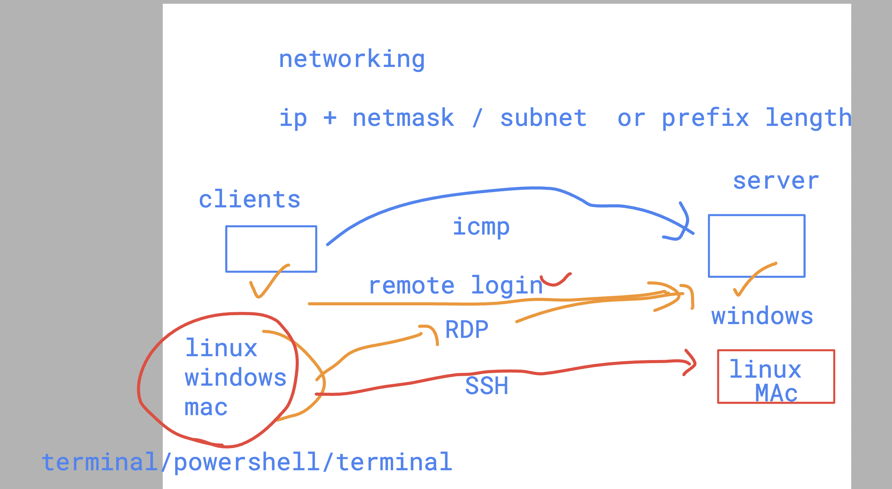
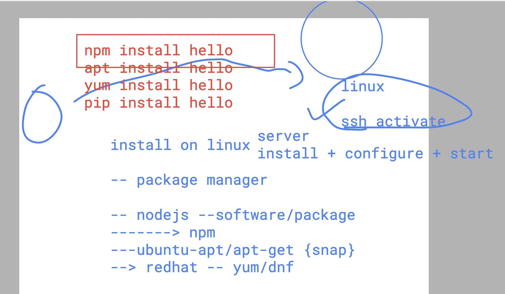

# SRE_Mastering

### understanding remote login 



## verify ssh command on client side 


### package manager in any os/language 




## setup openssh-server on ubuntu 

### checking os version 

```
root@0d44c4d2dafc:/# cat /etc/os-release 
PRETTY_NAME="Ubuntu 24.04 LTS"
NAME="Ubuntu"
VERSION_ID="24.04"
VERSION="24.04 LTS (Noble Numbat)"
VERSION_CODENAME=noble

```

### checking software / package status 

```
root@0d44c4d2dafc:/# dpkg  -s  openssh-server
dpkg-query: package 'openssh-server' is not installed and no information is available
Use dpkg --info (= dpkg-deb --info) to examine archive files.
root@0d44c4d2dafc:/# 

root@0d44c4d2dafc:/# 
root@0d44c4d2dafc:/# dpkg  -V  openssh-server
dpkg: package 'openssh-server' is not installed
root@0d44c4d2dafc:/# 


```

### Installing software 

```
root@0d44c4d2dafc:/# apt-get install openssh-server
Reading package lists... Done
Building dependency tree... Done
Reading state information... Done

```

### verify installation 

```
root@0d44c4d2dafc:/# dpkg  -s  openssh-server
Package: openssh-server
Status: install ok installed
Priority: optional
Section: net

```

### configuration file of ssh server in ubuntu 

```
cd /etc/ssh/
root@0d44c4d2dafc:/etc/ssh# ls
moduli      ssh_config.d        ssh_host_ecdsa_key.pub  ssh_host_ed25519_key.pub  ssh_host_rsa_key.pub  sshd_config
ssh_config  ssh_host_ecdsa_key  ssh_host_ed25519_key    ssh_host_rsa_key          ssh_import_id         sshd_config.d
root@0d44c4d2dafc:/etc/ssh# 
root@0d44c4d2dafc:/etc/ssh# 
root@0d44c4d2dafc:/etc/ssh# cat  /etc/ssh/sshd_config 


```

