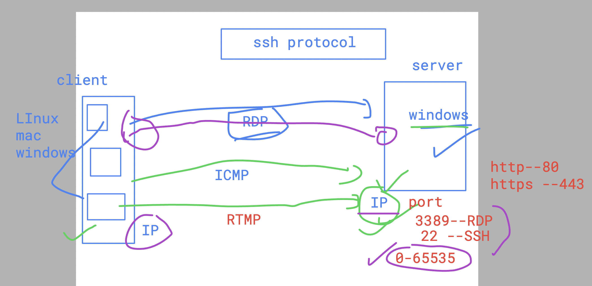

# SRE_Mastering

### info about IP and POrt 




### checking ip and port number of any linux system 

```
root@babykool:~# netstat -ltpn
Active Internet connections (only servers)
Proto Recv-Q Send-Q Local Address           Foreign Address         State       PID/Program name    
tcp        0      0 127.0.0.1:3306          0.0.0.0:*               LISTEN      1372/mysqld         
tcp        0      0 0.0.0.0:7070            0.0.0.0:*               LISTEN      1145/anydesk        
tcp        0      0 127.0.0.53:53           0.0.0.0:*               LISTEN      927/systemd-resolve 
tcp        0      0 127.0.0.1:631           0.0.0.0:*               LISTEN      1605/cupsd          
tcp        0      0 127.0.0.1:33060         0.0.0.0:*               LISTEN      1372/mysqld         
tcp        0      0 0.0.0.0:22              0.0.0.0:*               LISTEN      1181/sshd: /usr/sbi 
tcp6       0      0 :::3389                 :::*                    LISTEN      1246/xrdp           
tcp6       0      0 ::1:631                 :::*                    LISTEN      1605/cupsd          
tcp6       0      0 ::1:3350                :::*                    LISTEN      1165/xrdp-sesman    
tcp6       0      0 :::80                   :::*                    LISTEN      1336/apache2        
tcp6       0      0 :::22                   :::*                    LISTEN      1181/sshd: /usr/sbi 
```

### checking who is login into server

```
root@babykool:~# pinky 
Login    Name                 TTY      Idle   When             Where
baby     baby                ?:0       ?????  2024-06-22 00:18 :0
baby     baby                *pts/1           2024-06-22 00:58 192.168.1.4
ritik                         pts/2           2024-06-22 01:01 192.168.1.12
surbhi                        pts/3    00:14  2024-06-22 01:01 192.168.1.10
vikas    1q                   pts/4           2024-06-22 01:02 192.168.1.11

root@babykool:~# who
baby     :0           2024-06-22 00:18 (:0)
baby     pts/1        2024-06-22 00:58 (192.168.1.4)
ritik    pts/2        2024-06-22 01:01 (192.168.1.12)
surbhi   pts/3        2024-06-22 01:01 (192.168.1.10)
vikas    pts/4        2024-06-22 01:02 (192.168.1.11)

root@babykool:~# w
 01:20:16 up  1:02,  5 users,  load average: 1.32, 1.04, 0.95
USER     TTY      FROM             LOGIN@   IDLE   JCPU   PCPU WHAT
baby     :0       :0               00:18   ?xdm?  46:06   0.01s /usr/lib/gdm3/gdm-x-session --run-script env GNOME_SHELL_SESSION_
baby     pts/1    192.168.1.4      00:58    0.00s  0.22s  0.04s sshd: baby [priv]   
ritik    pts/2    192.168.1.12     01:01   38.00s  0.08s  0.08s -bash

```