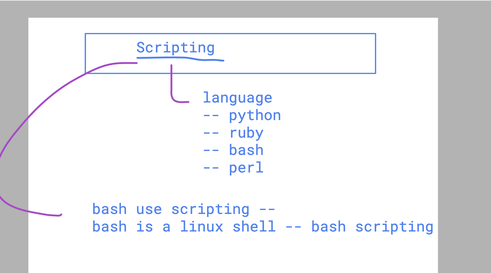
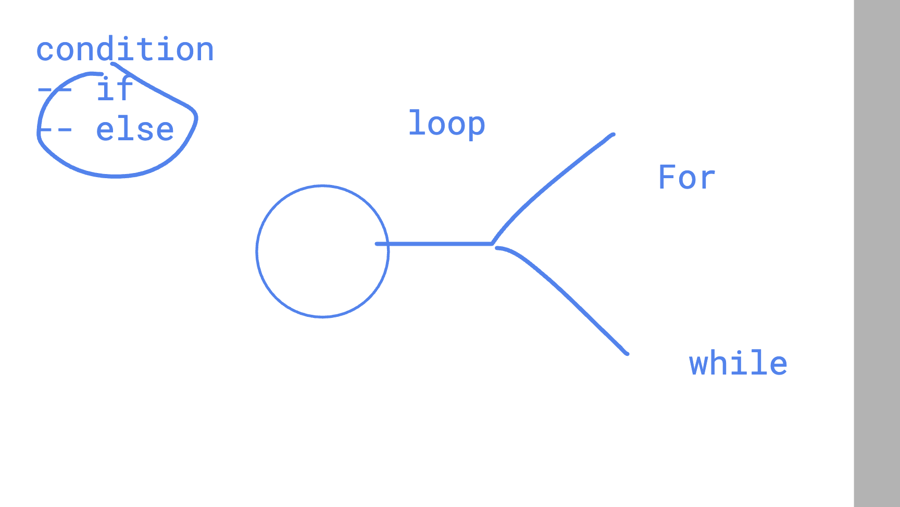

# SRE_Mastering

### Understanding scripting and shell scripting 



### how to run any shell script 

## method1 

```
bash hello.sh 
OR 
sh hello.sh 
```

## method 2 

```
chmod +x hello.sh 
azureuser@splunk-master:~$ ./hello.sh 
Sun Jul  7 15:32:51 UTC 2024

```

### Note : in above method user default shell will be used to run shell script 

### defining default shell in a scripting language

```
azureuser@splunk-master:~$ cat  hello.sh 

#!/bin/sh
# above sign #! is know as she bang Or hash bang 
date
cal
ls
pwd

```

### we can run shell usign full path 

```
/home/azureuser/hello.sh  

===
Sun Jul  7 15:40:14 UTC 2024
     July 2024        
Su Mo Tu We Th Fr Sa  
    1  2  3  4  5  6  
 7  8  9 10 11 12 13  
14 15 16 17 18 19 20  
21 22 23 24 25 26 27  
28 29 30 31           
                      
snap-private-tmp
systemd-private-ce946284e6e9473c8138d16c03f83536-ModemManager.service-Z3TORh
systemd-private-ce946284e6e9473c8138d16c03f83536-chrony.service-d4FC2i
systemd-private-ce946284e6e9473c8138d16c03f83536-systemd-logind.service-cKnYFh
systemd-private-ce946284e6e9473c8138d16c03f83536-systemd-resolved.service-RyURHi
/tmp

```

### loop in any language



