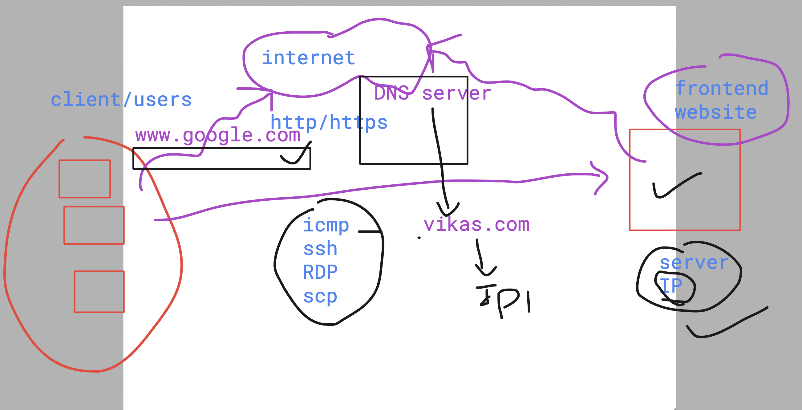
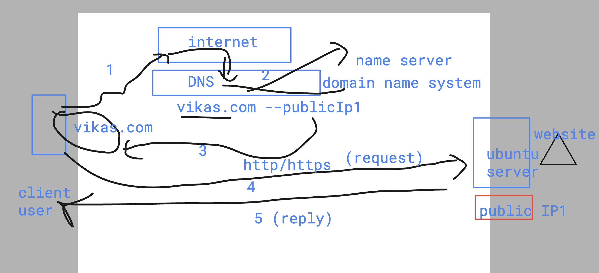

# SRE_Mastering

### How internet works 




### DNS understanding 



### In linux DNS ip address is stored in /etc/resolv.conf 

```
azureuser@sre-vm:~$ cat  /etc/resolv.conf 
# This file is managed by man:systemd-resolved(8). Do not edit.
#
# This is a dynamic resolv.conf file for connecting local clients to the
# internal DNS stub resolver of systemd-resolved. This file lists all
# configured search domains.
#
# Run "resolvectl status" to see details about the uplink DNS servers
# currently in use.
#
# Third party programs must not access this file directly, but only through the
# symlink at /etc/resolv.conf. To manage man:resolv.conf(5) in a different way,
# replace this symlink by a static file or a different symlink.
#
# See man:systemd-resolved.service(8) for details about the supported modes of
# operation for /etc/resolv.conf.

nameserver 127.0.0.53

```

### Note : if you comment that file of /etc/resolv.conf 

- if you comment nameserver line then you can't reach 
