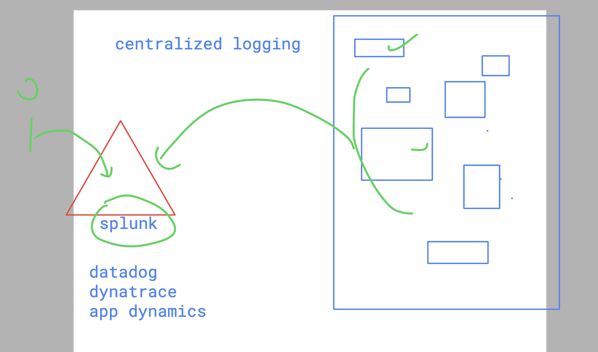

# SRE_Mastering

### configuring logs in nginx virtualhosting 

```
[root@ip-172-31-30-208 tmp]# cat  /etc/nginx/conf.d/ashu.conf 
server {
        listen       80;
        listen       [::]:80;
        server_name  ashu1.delvex.io;
        root         /usr/share/nginx/ashu;

	 access_log  /var/log/nginx/ashu.log  main;
	 error_log /var/log/nginx/ashu_error.log;
        # Load configuration files for the default server block.

        error_page 404 /404.html;
        location = /404.html {
        }

        error_page 500 502 503 504 /50x.html;
        location = /50x.html {
        }
    }

```

### make sure you have restart nginx service 

```
systemctl restart nginx 
```

### to access logs live 

```
tail -f /var/log/nginx/ashu.log
```


## Centralized loggin 



